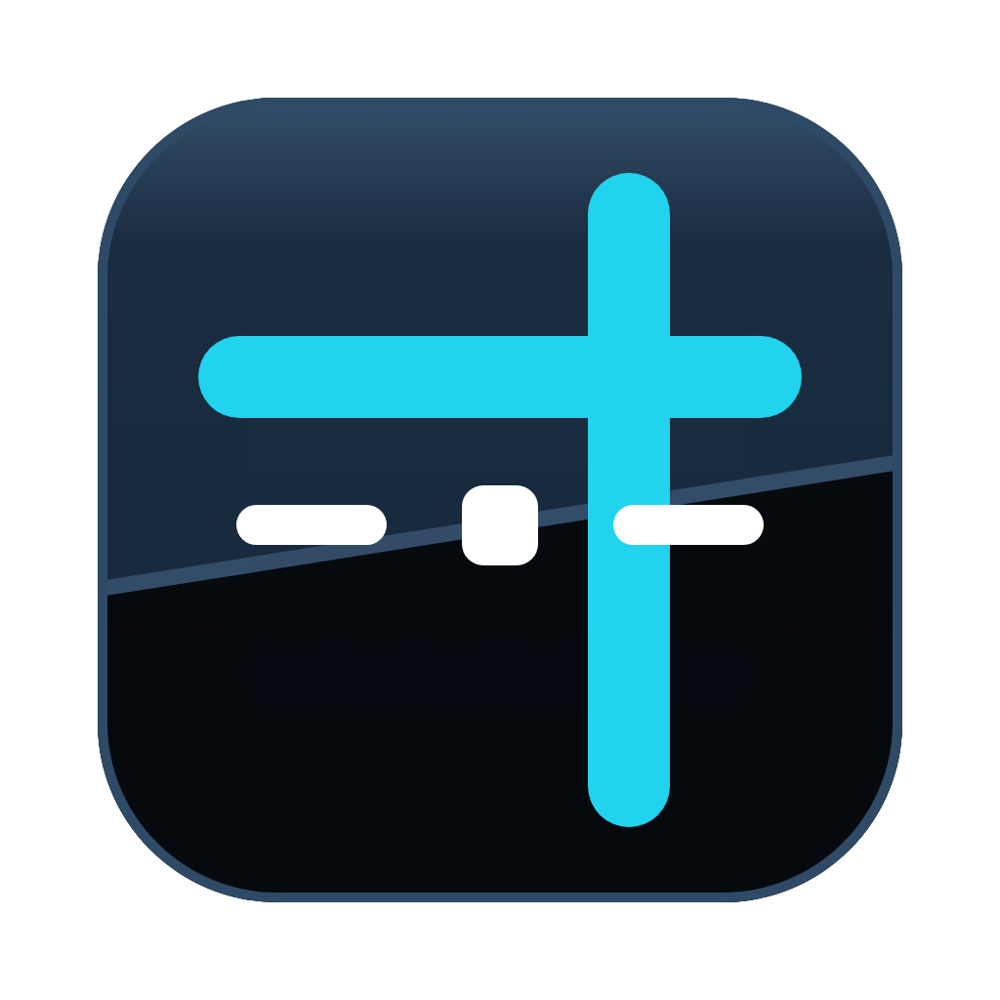
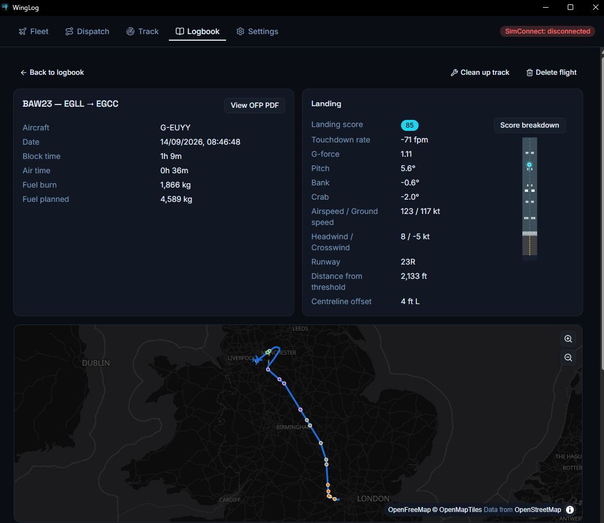
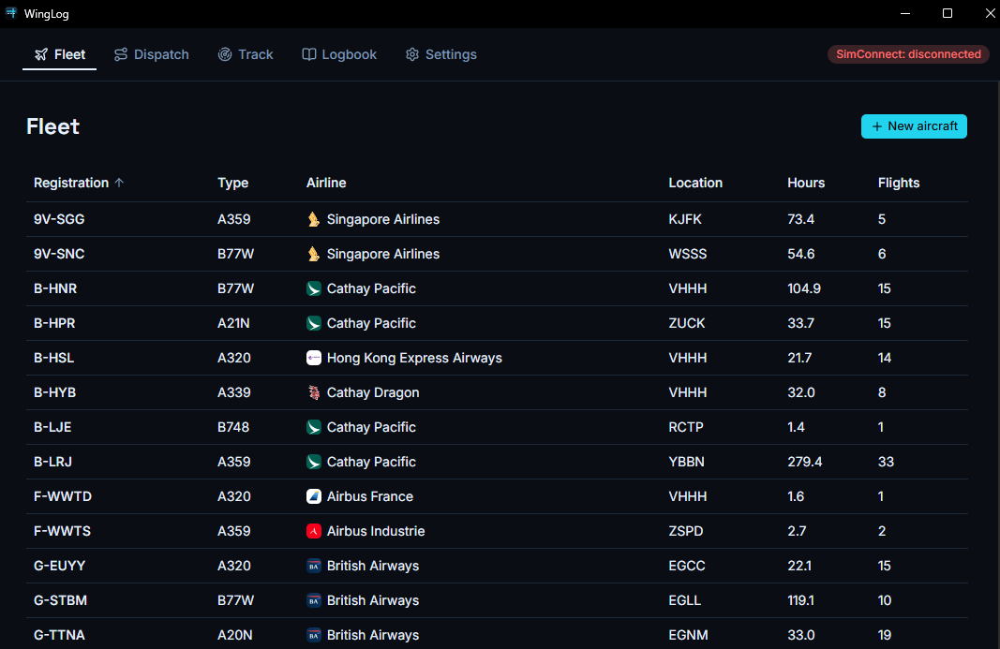
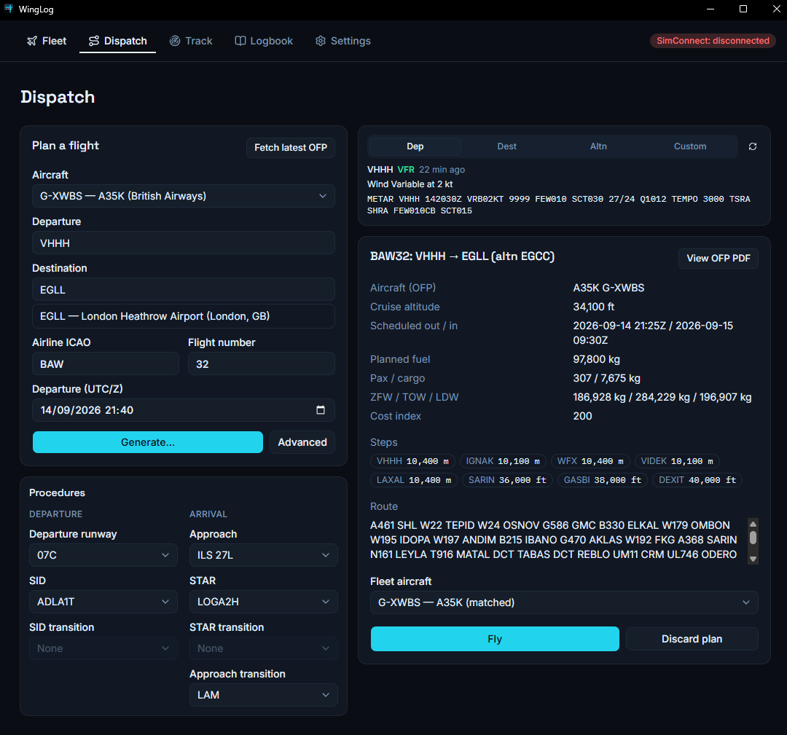
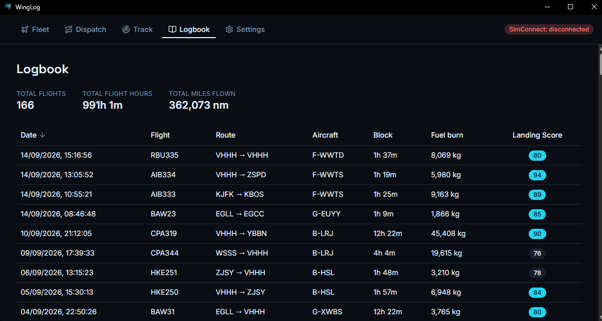

<p align="center">
  
</p>

<h1 align="center">WingLog</h1>

<p align="center">
  A free, local-first fleet, dispatch, tracking and logbook companion for<br/>
  Microsoft Flight Simulator 2024.
</p>

<p align="center">
  <a href="https://github.com/Catalyst4K/WingLog/actions/workflows/ci.yml"></a>
  <a href="./LICENSE"></a>
  <a href="https://github.com/Catalyst4K/WingLog/releases"></a>
</p>

---

WingLog manages your virtual airline the way you'd actually want to fly it: keep a real
fleet, dispatch a flight with a real SimBrief OFP, watch it tracked live from SimConnect
on a map, and land in a logbook that actually analyses how you flew — touchdown rate,
G-force, crosswind, centreline offset, a 0–100 landing score, all of it. Everything lives
in a local SQLite database on your own machine. No account, no cloud, no subscription.

## Screenshots

<p align="center">
  <br/>
  <sub>A flight's Logbook detail — real landing analysis, touchdown diagram, and track on the map.</sub>
</p>

<p align="center">
  
  
  
</p>

## Features

- **Fleet** — track your aircraft: registration, type, airline, current location, hours
  and cycles. Look up a real-world registration for its type, operator and a photo; link
  each tail to a SimBrief airframe profile for accurate weights.
- **Dispatch** — fetch or generate a real SimBrief OFP for your route, aircraft and
  airline, with live METARs for departure/destination/alternate. Pick a real SID, STAR,
  transition and approach straight from the sim's own navdata — no Navigraph subscription
  required — and see the full procedure plotted on the map before you fly.
- **Track** — live position, altitude, speed and phase-of-flight, read straight from
  SimConnect and drawn on a real-time map as you fly. Automatically detects takeoff,
  landing and taxi-in — most flights need no manual "start tracking" at all. Survives a
  WingLog restart mid-flight.
- **Logbook** — every completed flight, with block/air time, fuel burn, a flown-route map,
  altitude/speed charts, and a real landing report: touchdown rate, G-force, pitch, bank,
  crosswind, centreline offset, distance from threshold, and a 0–100 landing score with a
  category-by-category breakdown.
- **GSX ground-service tracking** — automatically finds GSX Pro's receipts and attaches
  catering/fuel/handling costs to the matching flight in your Logbook.
- **Import/export** — bring in an existing fleet or logbook (CSV), export your data back
  out. Your database, not a lock-in.
- **Runs entirely on your machine.** No account, no server, no telemetry. The only network
  call WingLog ever makes on your behalf is to SimBrief, to generate the OFP you asked
  for.

## Download

Grab the latest Windows installer from
**[Releases](https://github.com/Catalyst4K/WingLog/releases)**. Run it, pick an install
location, and launch WingLog — no separate runtime or dependency to install first.

A short getting-started guide ships with the installed app
(`resources/How to.md` in the install directory) and is also
[available here](./docs/HOW-TO.md).

### Requirements

- Windows 10/11
- Microsoft Flight Simulator 2024
- A free [SimBrief](https://www.simbrief.com/) account, for Dispatch

## Building from source

```
npm install       # rebuilds better-sqlite3 for Electron's ABI via postinstall
npm run dev
```

`npm run test`, `npm run lint` and `npm run typecheck` before committing. See
[`CLAUDE.md`](./CLAUDE.md) for the full command list, the project layout, and why the
test/migrate scripts run through Electron rather than plain Node.

To build an installer yourself: `npm run package:win`.

## Docs

- [`docs/HOW-TO.md`](./docs/HOW-TO.md) — using WingLog, for pilots (also ships inside the
  installed app).
- [`CLAUDE.md`](./CLAUDE.md) — working agreement for Claude Code sessions in this repo.
- [`CONTRIBUTING.md`](./CONTRIBUTING.md) — how contributions are licensed, and what can
  and can't be added as a dependency. Read this before opening a PR.
- [`SECURITY.md`](./SECURITY.md) — reporting a vulnerability.

## Licence

WingLog is free software, licensed under the **GNU General Public License v3.0** — see
[`LICENSE`](./LICENSE). You may use, study, modify and redistribute it, including
commercially; derivative works must also be GPL-3.0 and must make their source available.

Copyright (C) 2026 Callum Jones — see [`COPYRIGHT`](./COPYRIGHT) for the full notice.
Copyright in the first-party code is held solely by the author, who retains the right to
offer the software under other terms as well. If GPL-3.0 doesn't suit your use case, ask;
see [`CONTRIBUTING.md`](./CONTRIBUTING.md) for how contributions are licensed so that
stays possible.

Third-party code and data distributed with the app — including
[node-simconnect](https://github.com/EvenAR/node-simconnect) (LGPL-3.0-or-later) and three
vendored reference datasets — are covered by
[`THIRD-PARTY-LICENSES.md`](./THIRD-PARTY-LICENSES.md), which is generated by
`npm run licenses:generate` and shipped inside the packaged app.

WingLog is not affiliated with, endorsed by, or sponsored by Microsoft Corporation or
Asobo Studio. "Microsoft Flight Simulator" is a trademark of its respective owners.
