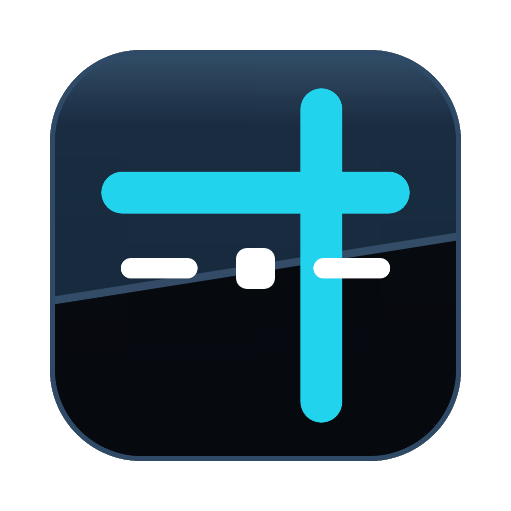
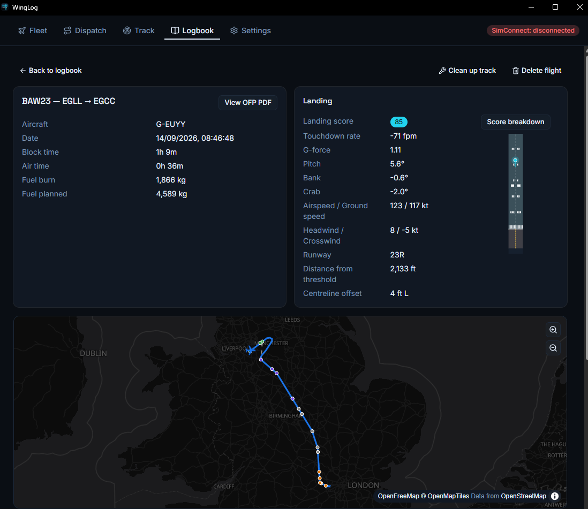
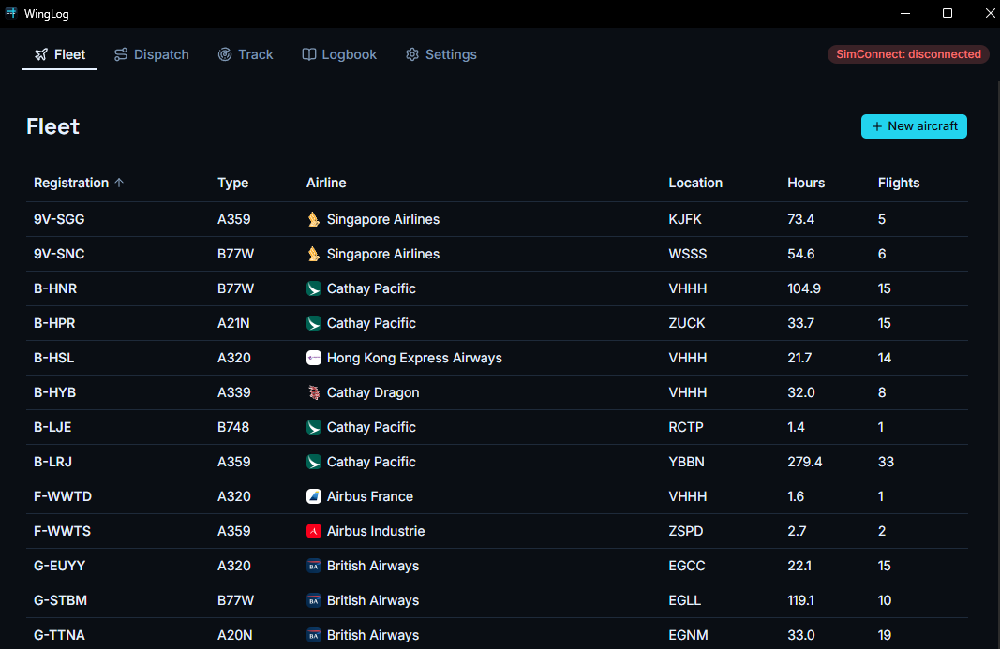
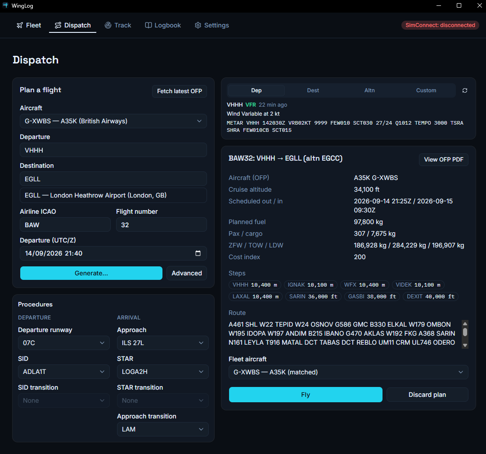
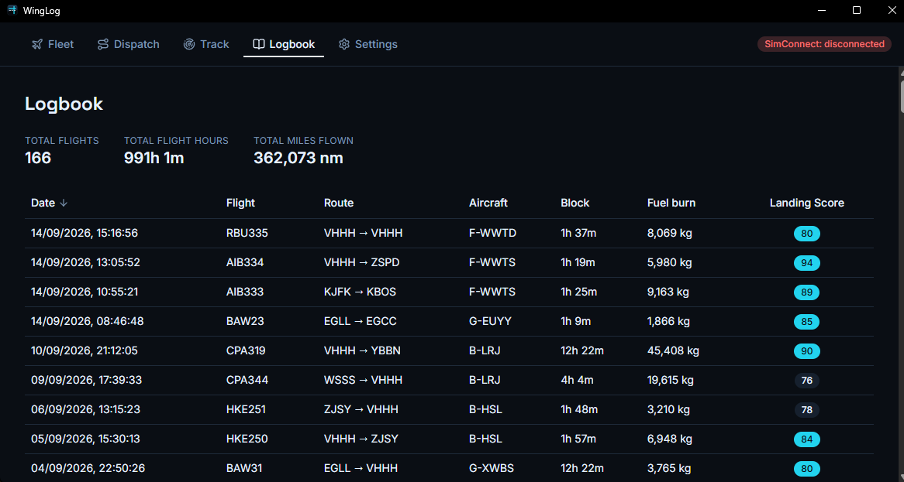
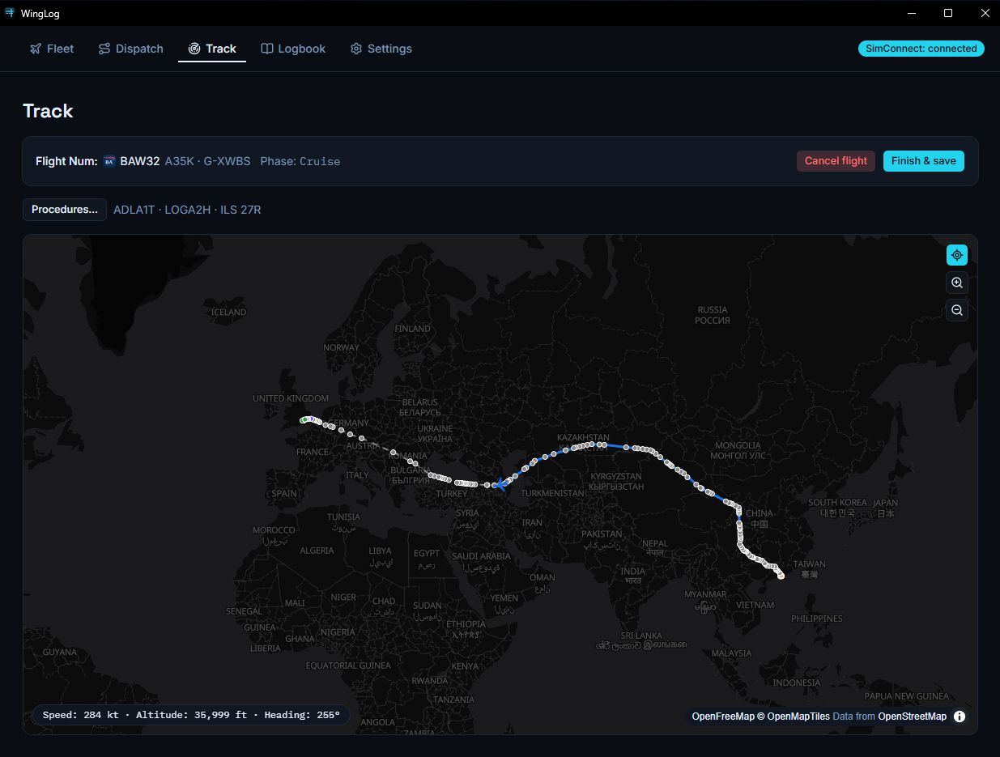
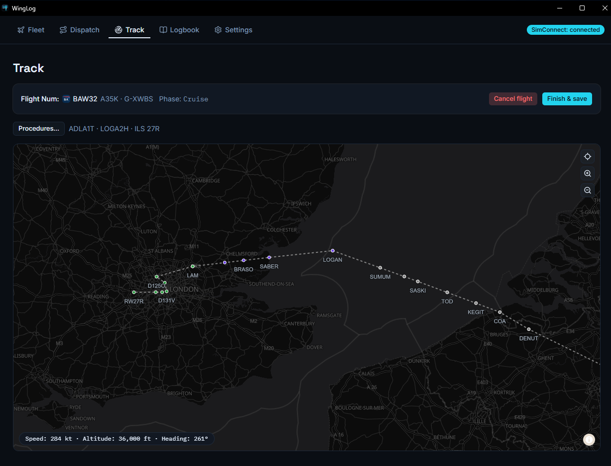

<p align="center">
  
</p>

<h1 align="center">WingLog</h1>

<p align="center">
  A free companion app for Microsoft Flight Simulator 2024: your fleet, SimBrief dispatch,<br/>
  live tracking, and a logbook that scores every landing. Works with BeyondATC and GSX Pro.
</p>

<p align="center">
  <a href="https://github.com/Catalyst4K/WingLog/actions/workflows/ci.yml"></a>
  <a href="./LICENSE"></a>
  <a href="https://github.com/Catalyst4K/WingLog/releases"></a>
</p>

---

Keep a real fleet, plan each flight with a SimBrief OFP, fly it with WingLog tracking you live on a
map, and land in a logbook that tells you how you did: touchdown rate, G-force, crosswind,
centreline offset and a 0-100 landing score. If you fly with BeyondATC, WingLog reads your
clearances, fills in your procedures, draws your taxi route and can ask for your step climbs. Your
data stays in a database on your own PC.

> **For flight simulation use only.** WingLog must never be used for real-world navigation, flight
> planning, or in a real aircraft.

## Screenshots

<p align="center">
  <br/>
  <sub>A flight's Logbook detail — real landing analysis, touchdown diagram, and track on the map.</sub>
</p>

<p align="center">
  
  
  
</p>

<p align="center">
  
  
</p>
<p align="center"><sub>Track — live position from SimConnect against the planned route, with waypoints and procedures.</sub></p>

## Features

- **Fleet.** Registration, type, airline, location, hours and flights for each aircraft. Look up a
  real registration for its type, operator and photo, link a SimBrief airframe for accurate
  weights, and see the stand each aircraft last parked at so the next flight starts from the same
  gate.
- **Dispatch.** Generate or fetch a SimBrief OFP, check the METARs, and pick your SID, STAR,
  transitions and approach from the sim's own navdata, with no navdata subscription needed.
- **Track.** Live position, phase and route on a map that follows you, zooming out as you climb.
  ET, time remaining and ETA against SimBrief's schedule. Starts and finishes by itself (or with a
  button, if you prefer), and survives WingLog closing mid-flight. A taxi chart of the airport from
  the sim's own data, a VFR overlay, and **free flight** for anything you fly without a plan.
- **Logbook.** Every flight with block and air time, fuel, the route flown, altitude and speed
  charts, and a landing report for every touchdown, including circuits: touchdown rate, G-force,
  pitch, bank, crab, crosswind, distance from threshold, centreline offset and a 0-100 score with a
  category-by-category breakdown.
- **BeyondATC.** Clearances broken into fields, the transcript, BeyondATC's actions and frequencies,
  procedures filled in from your clearance, your cleared taxi route drawn on the map, and automatic
  step climbs from your SimBrief plan.
- **GSX Pro.** Run GSX's menu, services and pushback from inside WingLog through GSX's own Remote
  Control connection, with the stand ATC assigned one click away in the gate search. GSX receipts
  are attached to the matching flight in your Logbook.
- **In your language.** English, Deutsch, Español, Français, Italiano, Русский, 简体中文 and 繁體中文.
- **Import and export** your fleet and logbook as JSON or CSV (SimToolkitPro logbooks too).

A short setup on first launch walks through the settings that matter, and a full PDF manual ships
with the app (**Settings → About → Manual**).

## Download

Get the latest Windows installer from
**[GitHub Releases](https://github.com/Catalyst4K/WingLog/releases)** or
**[flightsim.to](https://flightsim.to/)**. Both always carry the same version. WingLog tells you
when a newer one is out.

The installer isn't code-signed, so Windows SmartScreen may warn you the first time: choose **More
info**, then **Run anyway**.

### Requirements

- Windows 10 or 11, 64-bit
- Microsoft Flight Simulator 2024
- A free [SimBrief](https://www.simbrief.com/) account, for Dispatch
- Optional: [BeyondATC](https://www.beyondatc.net/), GSX Pro

## What leaves your computer

Your fleet and logbook stay in a database on your own PC. WingLog only goes online for the
features that need it:

| What | When | What's sent |
|---|---|---|
| SimBrief / Navigraph | Planning or fetching a flight, logging in | Your SimBrief username or login, through WingLog's own login service |
| Weather (aviationweather.gov) | Showing METARs | Airport codes |
| Map tiles (OpenFreeMap) | Showing the map | The area you're looking at |
| Aircraft lookup | Pressing **Look up** in Fleet | The registration |
| Exchange rates (Frankfurter) | Showing GSX invoices in your currency | The currencies |
| Airline logos | Showing an airline | The airline code |
| Update check (GitHub) | Shortly after launch and every 6 hours, if on | A request for the latest version number only |

No analytics, no telemetry, no adverts.

## Building from source

```
npm install       # rebuilds better-sqlite3 for Electron's ABI via postinstall
npm run dev
```

`npm run test`, `npm run lint` and `npm run typecheck` before committing. See
[`CLAUDE.md`](./CLAUDE.md) for the full command list, the project layout, and why the
test/migrate scripts run through Electron rather than plain Node.

To build an installer yourself: `npm run package:win` (it builds the manual first with
`npm run manual:build`).

## Docs

- [`docs/manual/`](./docs/manual/): the user manual, in Markdown. The PDF built from it ships with
  the app.
- [`CLAUDE.md`](./CLAUDE.md): working agreement for Claude Code sessions in this repo.
- [`CONTRIBUTING.md`](./CONTRIBUTING.md): how contributions are licensed, and what can and can't be
  added as a dependency. Read this before opening a PR.
- [`SECURITY.md`](./SECURITY.md): reporting a vulnerability.

## Licence

WingLog is free software, licensed under the **GNU General Public License v3.0** — see
[`LICENSE`](./LICENSE). You may use, study, modify and redistribute it, including
commercially; derivative works must also be GPL-3.0 and must make their source available.

Copyright (C) 2026 Callum Jones — see [`COPYRIGHT`](./COPYRIGHT) for the full notice.
Copyright in the first-party code is held solely by the author, who retains the right to
offer the software under other terms as well. If GPL-3.0 doesn't suit your use case, ask;
see [`CONTRIBUTING.md`](./CONTRIBUTING.md) for how contributions are licensed so that
stays possible.

Third-party code and data distributed with the app — including
[node-simconnect](https://github.com/EvenAR/node-simconnect) (LGPL-3.0-or-later) and four
vendored reference datasets — are covered by
[`THIRD-PARTY-LICENSES.md`](./THIRD-PARTY-LICENSES.md), which is generated by
`npm run licenses:generate` and shipped inside the packaged app.

**For flight simulation use only.** WingLog must never be used for real-world navigation,
flight planning, or in a real aircraft.

WingLog is an independent, free project. It is not affiliated with, endorsed by, or sponsored
by Microsoft Corporation, Asobo Studio, Skirmish Mode Games (BeyondATC), FSDreamTeam (GSX),
Navigraph (SimBrief), or OpenFreeMap. "Microsoft Flight Simulator", "BeyondATC", "GSX",
"SimBrief" and "Navigraph" are trademarks of their respective owners.
