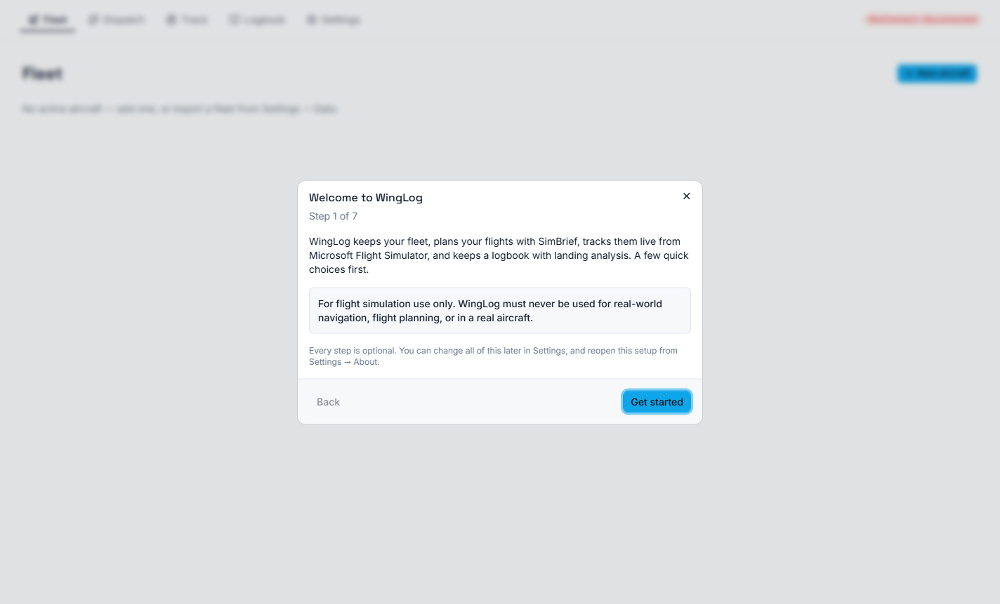
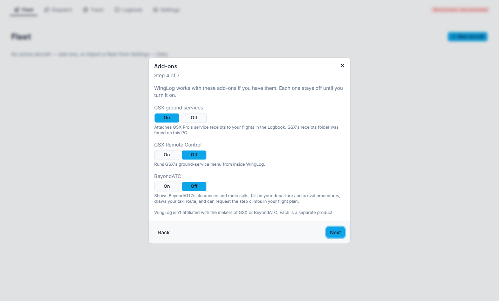

# First launch

The first time you start WingLog, a short setup walks you through the settings that matter. Every
step is optional: **Next** moves on without changing anything, and closing the window at any point
finishes the setup. You can run it again any time from **Settings → About → Run setup again**.

| Step | What you choose |
|---|---|
| Welcome | Nothing to set. A reminder that WingLog is for simulation only. |
| SimBrief | Your SimBrief username (your Navigraph alias), so Dispatch can fetch your flight plans. |
| Language and units | App language, map language, and units for weights, altitudes, wind and landing distances. |
| Add-ons | GSX ground services, GSX Remote Control and BeyondATC, each on or off. |
| Tracking | Whether WingLog starts and finishes tracking flights by itself. |
| Updates | Whether WingLog checks for new versions. |
| Done | Nothing to set. |

## About the add-ons step

WingLog looks for GSX's receipts folder and checks whether BeyondATC is running, and tells you what
it found. It never switches an add-on on by itself: each one stays off until you choose **On**.

- **GSX ground services** attaches GSX Pro's service receipts to your flights in the Logbook.
- **GSX Remote Control** adds a **Ground services** page for running GSX's menu from inside WingLog.
- **BeyondATC** adds a **BeyondATC** page, fills in your procedures from clearances, draws your taxi
  route and can request step climbs.

## Upgrading from an earlier version

If you already have aircraft or flights, the setup doesn't appear. Instead, a short note lists
what's new, and everything else stays as you had it. Run the setup from **Settings → About** if you
want to go through it anyway.
