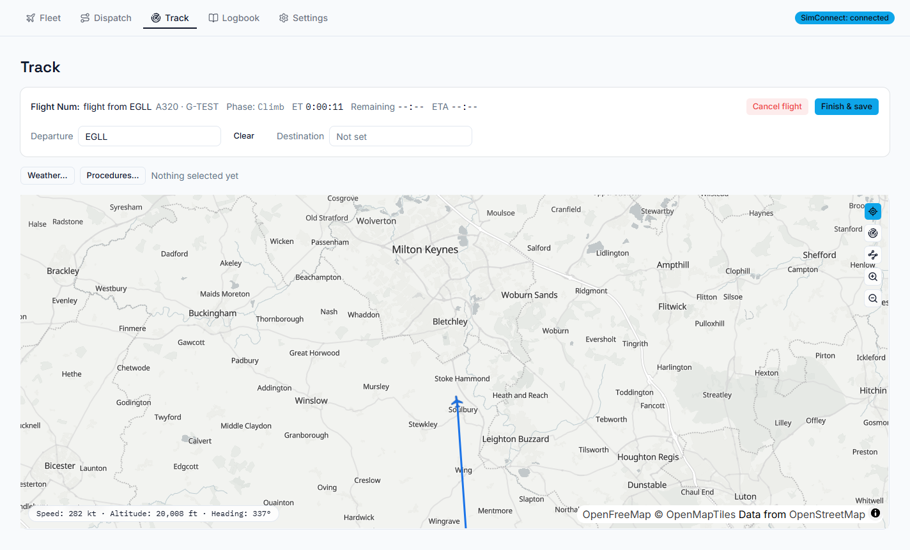

# Track

Track is the live view of your flight: a map, your phase of flight, times, procedures and weather.

## Starting a flight

After you press **Fly** in Dispatch, load into MSFS at the departure airport. Once the aircraft is
settled on the ground at roughly the right place, WingLog starts tracking by itself. If it doesn't
(for example, you loaded somewhere unusual), press **Start tracking**.

If WingLog sees an aircraft moving on the ground, or already airborne, with no flight being tracked,
a banner offers to start tracking it.

Automatic starting can be switched off in **Settings → UI → Tracking** if it ever misbehaves with
your setup; the **Start tracking** button always works.

## Free flights

No SimBrief plan? Press **Free flight** to track whatever you're flying: a VFR hop, circuits, a
sightseeing loop. The aircraft can be left as *None* and added to your fleet later from the Logbook.
Fill in the **Departure** and **Destination** boxes whenever you know them; the real arrival airport
is worked out from where you actually land.

## The map

The map follows your aircraft, with the route you planned in blue and the route you've flown drawn
behind you.

- **Follow.** The target button (top right) switches following on and off. With it off you can pan
  around freely.
- **Zoom.** Following zooms in close on the ground, then steps out as you climb: one level below
  10,000 ft, one more up to FL250, and further out above that. Zooming yourself is kept until the
  next of those steps.
- **VFR overlay** (radar button): every airfield including small strips and heliports, 5/10/20 nm
  range rings, a nautical scale bar, your last ten minutes of track highlighted, and the nearest
  airfield.
- **Taxi chart** (taxiway button): the full taxiway network at your departure or arrival airport,
  from the sim's own airport data. The first load at a large airport can take a few minutes. With
  BeyondATC on, your cleared taxi route is drawn on it (see [BeyondATC](07-beyondatc.md)).

Below the map: indicated airspeed, altitude and heading.

## Times

| Readout | Meaning |
|---|---|
| **ET** | Time since takeoff, to the second. |
| **Remaining** | Distance left along your planned route at your current ground speed. Shown once you're moving. |
| **ETA** | Arrival time in UTC, with how far ahead or behind SimBrief's schedule you are. On the ground it shows SimBrief's planned arrival instead. |

For a free flight these use a great-circle line to the destination.

## Procedures and weather

**Procedures…** changes your SID, STAR, approach and transitions in flight (pick *None* to remove
one). For a flight with an alternate, switch **Arrival airport** to the alternate to see its STARs
and approaches, which is handy for a diversion. **Weather…** shows the METARs for your departure,
destination and alternate, and for any airport you look up.

## Finishing a flight

When you've landed, parked and shut the engines down, WingLog finishes the flight and saves it to the
Logbook by itself. You can also press **Finish & save** at any time. **Cancel flight** throws the
flight away instead of saving it.

Automatic finishing can be switched off in **Settings → UI → Tracking**.

## If WingLog closes mid-flight

Nothing is lost. Next time WingLog starts, it offers to **resume tracking** (if the flight is still
going in the sim) or discard it. If resuming left odd points in the track (a jump across the map,
for example), open the flight in the Logbook and use **Clean up track** to remove them.
