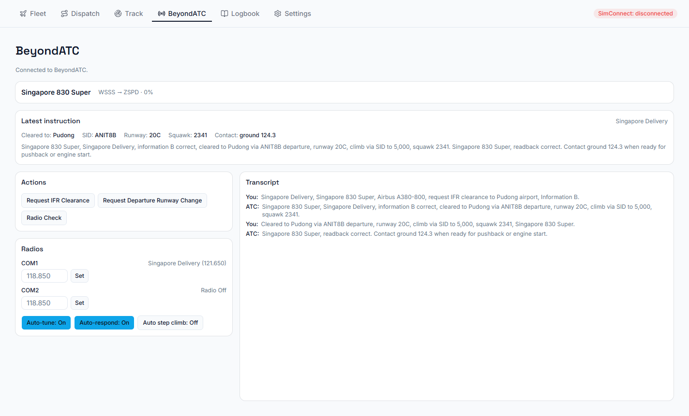

# BeyondATC

If you fly with BeyondATC, WingLog connects to it and uses what ATC gives you: it shows your
clearances, fills in your procedures, draws your taxi route, finds your arrival gate, and can ask ATC
for your planned step climbs. BeyondATC itself is still what talks to you; WingLog works alongside
it.

WingLog reads your clearances from the information fields BeyondATC shows in its own menu (SID,
runway, taxiways, gate and so on), not from what ATC says out loud. So how a clearance is worded
doesn't matter. Use a current version of BeyondATC, which shows these fields.

> BeyondATC is a separate product by Skirmish Mode Games. WingLog isn't affiliated with them.

## Turning it on

**Settings → 3rd party → BeyondATC → On**. Leave the host as `localhost` when BeyondATC runs on the
same PC. A **BeyondATC** page appears, and the line at the top shows whether WingLog is connected.
BeyondATC can be started before or after WingLog.

## The BeyondATC page

- **Info**: the ATC facility you're talking to, COM2, your callsign and route progress.
- **Latest instruction**: the last clearance or instruction from ATC, broken into fields: cleared-to
  airport, SID, STAR, approach, transition, runway, altitudes, QNH, squawk, the frequency to
  contact, holding point, gate and taxiways. A "readback correct" adds the next frequency without
  wiping the clearance. Once ATC gives you your arrival (STAR and runway, then the approach and
  transition), it stays in this card's header until you land, while the card itself carries on
  showing each new instruction.
- **Actions**: the same requests BeyondATC offers in its own menu (request clearance, taxi, and so
  on). Press one to send it. When BeyondATC has to wait for a gap on the frequency, the button stays
  highlighted and the line above says **Queued**, then **Transmitting…**, then **Awaiting ATC's
  reply**.
- **Radios**: set COM1 and COM2 by typing a frequency or choosing from **Frequencies** (departure
  and arrival airports, with runway-specific approach frequencies). **Auto-tune** and
  **Auto-respond** are BeyondATC's own settings, switched from here. **Auto step climb** is
  WingLog's (see below).
- **Transcript**: every radio call, yours, ATC's and other traffic's.

## Procedures from your clearance

When ATC clears you for a SID, a STAR or an approach, or gives you a runway, that's different from
what you have selected, WingLog asks **Update procedure from ATC clearance?** Choose **Update** to
switch your procedures to match, or **Dismiss** to keep yours.

- **Names match the sim's.** BeyondATC's approach names are matched to the airport's own, so "R-NAV
  approach runway 02L" selects the sim's RNAV 02L.
- **A runway picks its approach.** When ATC gives you a STAR and runway but no approach yet, WingLog
  suggests the approach your STAR actually leads into (for example ILS Z rather than ILS X, when
  only ILS Z starts where the STAR ends), with that transition.
- **No repeat questions.** When ATC later confirms what you've already accepted, nothing is asked
  again.

## Your taxi route on the map

Switch on the **taxi chart** on the Track map. When ATC gives you a taxi clearance, WingLog draws the
route on the chart: from your aircraft, along the taxiways in the order cleared, to the holding point
(or to your gate after landing). The line shortens behind you as you taxi.

- **If you leave the route.** Taxi off the line, or the wrong way along it, and after a few seconds
  WingLog redraws it from where you are: the shortest way to the same holding point or gate, joining
  ATC's route wherever that's quickest. It never sends you back behind you unless you're at a dead
  end, and it doesn't redraw during pushback or once you've reached the hold.
- **Hold short.** When a clearance ends "hold short of runway …", the route ends at that hold short.
  The rest comes with the next clearance.
- **Departure route removed.** It's taken off the map once your takeoff roll starts, and the arrival
  route appears when you're cleared to taxi after landing. A fast taxi doesn't count as a takeoff
  roll: WingLog checks you're on a runway.

## Automatic step climbs

With **Auto step climb** on (BeyondATC page → Radios), WingLog asks ATC for your step climbs at the
right time, using BeyondATC's **Request Altitude Change** menu, just as you would.

- **Planned steps.** Steps in your SimBrief plan are requested as you approach the step's waypoint.
- **Your own climbs.** If you set a higher altitude on the autopilot and the aircraft starts
  climbing, WingLog requests that level too, as long as it's no more than 4,000 ft above your
  cleared altitude. Turning the knob without climbing does nothing.
- **Never in the descent.** Once you're past top of descent, no more requests are made.
- The status line shows the next planned step, any request in progress and how ATC answered. If a
  level isn't offered or ATC doesn't clear it, WingLog tries once more, then gives up on that step.
- WingLog knows your cleared altitude from BeyondATC's own altitude field, in flight levels or
  metres.

Auto step climb starts **off** each time WingLog starts.

## Your gate for GSX

BeyondATC assigns your arrival gate before it tells you, often a minute or more before the taxi
call. The GSX gate search offers that gate with one click, for the times BeyondATC's own handover to
GSX doesn't happen by itself (see [GSX](08-gsx.md)).
