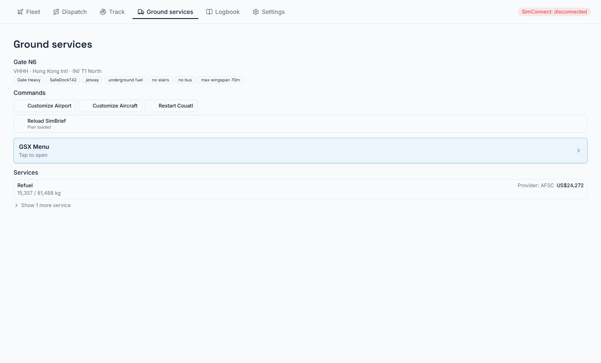

# GSX

WingLog works with GSX Pro by FSDreamTeam in two separate ways. Each has its own switch in
**Settings → 3rd party**.

> GSX Pro is a separate product by FSDreamTeam. WingLog isn't affiliated with them.

## Ground-service receipts

GSX Pro writes a receipt for each service it provides (catering, fuel, handling, passenger buses).
With **GSX ground services** on, WingLog attaches them to the matching flight in your Logbook, under
**Ground services**, with a total in the currency you choose.

- WingLog looks in GSX's usual receipts folder (`%APPDATA%\Virtuali\GSX\Receipts`). Use **Browse…**
  if yours is somewhere else.
- **Display currency** converts totals with a live exchange rate when you view them.
- A receipt that doesn't say which aircraft it was for isn't attached automatically. The flight
  shows it as a possible match with an **Attach** button.
- **Rescan** looks again, for example after turning this on for flights you've already flown.

## GSX Remote Control

GSX Pro has a remote-control connection meant for other apps to use. With **GSX Remote Control** on,
WingLog's **Ground services** page runs GSX's menu without the in-sim window:

- **GSX Menu**: tap to open GSX's menu, then pick entries just as you would in the sim. Menus that
  need an answer straight away (pushback direction, fuel amount) also pop up over whatever page
  you're on.
- **Commands**: Customize Airport, Customize Aircraft, Restart Couatl, and reloading your SimBrief
  plan into GSX.
- **Services**: each service's progress (boarding, refuelling and so on), with what it's waiting for
  and its cost.
- The gate you're at is shown at the top.

The port is GSX's own default, 8744. If it doesn't connect, check **Remote Client** in GSX's own
settings.

### Finding your arrival gate

When you search GSX for a gate after landing, the gate search offers the stand ATC gave you (with
BeyondATC on), for example **Stand N32 (from ATC)**. Click it to type it into GSX's search. Nothing
is sent to GSX until you click.
