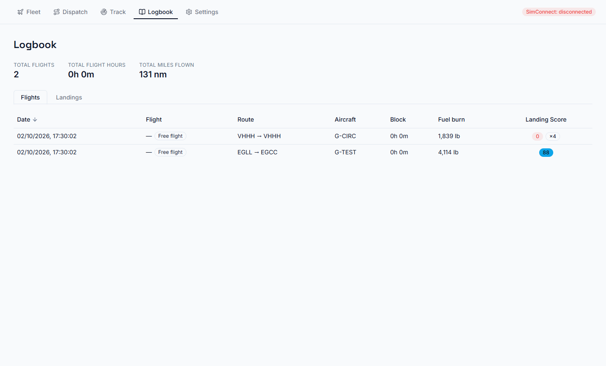
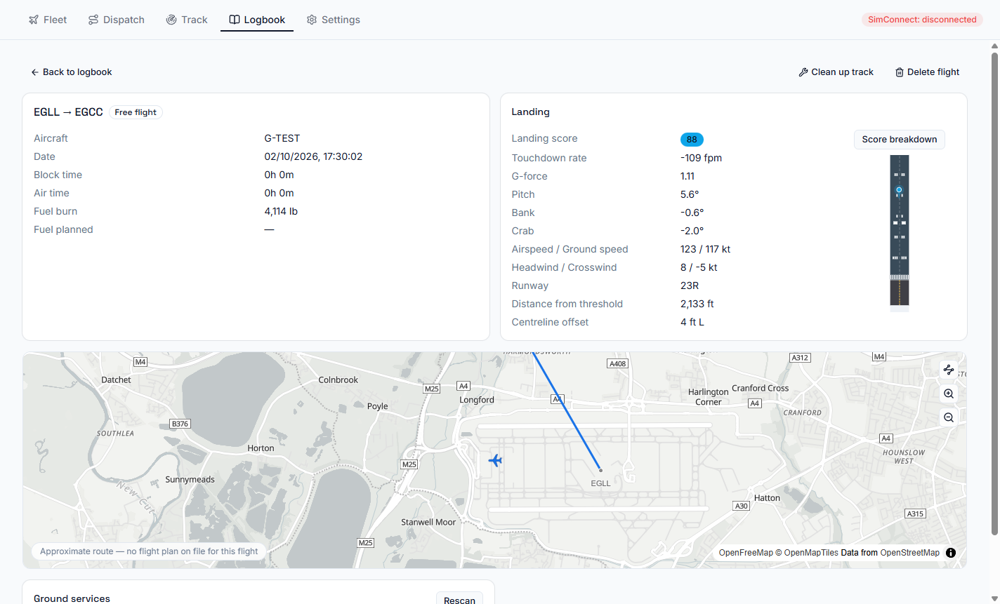

# Logbook

Every completed flight lands in the Logbook. The top of the page shows your totals: flights, flight
hours and miles flown.

## Flights and Landings

- **Flights** lists every flight. Sort by date, flight number, route, aircraft, block time, fuel
  burn or landing score.
- **Landings** lists every touchdown separately, including circuits and touch-and-goes. Each one is
  labelled by airfield and attempt (`EGLL 1`, `EGLL 2`). Sort by date, airport and runway, aircraft,
  touchdown rate, G-force or score.

## A flight's page

Click a flight to see:

- aircraft, date, **block time** (off-blocks to on-blocks), **air time**, fuel burned and planned;
- the route you flew on a map, against the planned route (a great-circle line if there was no plan);
- altitude and speed charts across the flight, and planned versus actual fuel;
- the **landing report** (below);
- **Ground services**: GSX receipts for this flight, if that's switched on;
- **View OFP PDF** for SimBrief's flight plan;
- **Add to fleet** for a free flight flown in an aircraft that isn't in your fleet yet;
- **Clean up track**, if a resumed flight left odd points in its track;
- **Delete flight**.

## The landing report

For each touchdown: touchdown rate, G-force, pitch, bank, crab, airspeed and ground speed, headwind
and crosswind, the runway, **distance from threshold** and **centreline offset**, with a diagram of
where on the runway you touched down. Landings at airfields missing from WingLog's built-in list
(scenery add-ons, closed airports) are looked up from the sim itself.

### Landing score

Each landing gets a score out of 100. **Score breakdown** shows exactly where points went:

| Category | Points |
|---|---|
| Touchdown rate | 25 |
| Distance from the aiming point | 20 |
| G-force | 15 |
| Centreline offset | 10 |
| Pitch | 10 |
| Bank | 10 |
| Crab | 10 |

Each category scores full marks near its ideal and loses points faster the further off it is. The
ideal touchdown rate depends on the aircraft's size (a light aircraft, a medium jet and a heavy are
judged differently). **What's ideal for …?** in the breakdown shows the targets.

Going past a safe limit in any category (a very hard touchdown, a big bank angle, landing far down
the runway) adds a separate **Dangerous** penalty on top, so an unsafe landing can't score well just
because everything else was tidy. A **Firm** or **Hard** badge marks rougher landings in the lists.

## Importing an existing logbook

**Settings → Data → Logbook → Import** reads WingLog's own exports and SimToolkitPro CSV files.
Imported flights have no recorded track, so their map shows a great-circle line.
